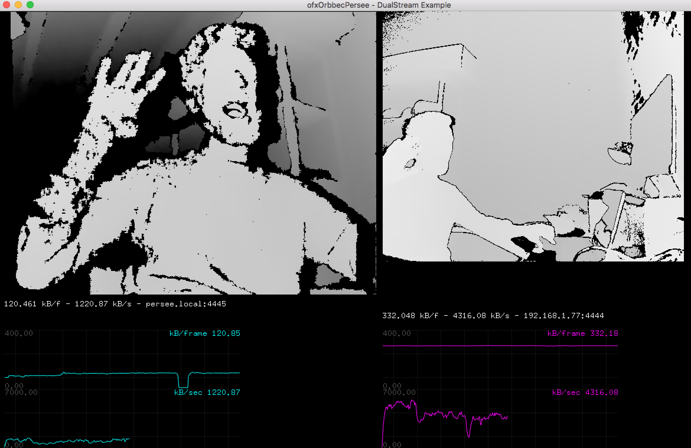

# ofxOrbbecPersee

OpenFrameworks addon with _heavily opiniated_ tools for working with the Orbbec **Persee**.


## Rational

The Orbbec Persee is a point-cloud sensor with embedded programmable computer system (think; an Kinect stacked on top of a Raspberry PI), designed to
run as a stand-alone device. This addon provides a library and (example) applications for _both_;
 * Running a server app on the persee (which transmits data over the network)
 * Running a client apps (which use the data streamed over the network by the persee)

## Instructions

#### Install Ubuntu
The Persee come pre-installed with Android but all tooling and examples seem to be out-dated and the general consensus seems to be that it's better to install Ubuntu.

There is very little official documentation and your best source for information is [orbbec's forum](https://3dclub.orbbec3d.com): ["Universal download thread" where you can find the Ubuntu image (instructions included)](https://3dclub.orbbec3d.com/t/universal-download-thread-for-persee/694). _Spoiler: you'll need a windows machine to run the tools necessary to install the image (running window inside VirtualBox didn't work for me) \o/_

Once you've installed Ubuntu you can SSH into the device (default user: ubuntu, default password: ' ' [a single space]), and continue with a common linux command-line workflow (when using OpenFrameworks you'll need to grab the "linux armv7" version of OpenFrameworks);

#### Install and run PerseeServer on Persee
See the README in the tools/PerseeServer folder of this repo

#### Build and Run the Client on your dev machine
Currently there are only _make_ build-files for the clients (no xcode or visual studio).

```cd``` into one of the example application's folders and run:
```bash
make Debug # to build the applications
make RunDebug # to run the last development-build
```

## SDK Usage

#### Basic Usage
See also the example applications

```c++
#include "ofxOrbbecPersee/ofxOrbbecPersee.h"

std::shared_ptr<persee::Receiver> receiverRef;
ofTexture depthTexture;
ofMesh mesh1;

void ofApp::setup() {
   // Create depth stream network receiver (takes a hostname/ip string and port number)
   // this receiver instance will start a separate thread in which it listens for new frame data
   receiverRef = persee::Receiver::createAndStart("persee.local", 4445);
}

void ofApp::update() {
  // this addons provides some convenience methods for;
  // ...processing raw frame byte data (which is compressed for network streaming)
  persee::emptyAndInflateBuffer(*receiverRef, [this](const void* data, size_t size){

    // ...loading texture data
    ofxOrbbecPersee::loadDepthTexture(this->depthTexture, data, size);

    // ...loading mesh data
    ofxOrbbecPersee::loadMesh(this->mesh1, data, size);
  }
}

void ofApp::draw() {
  if(depthTexture.isAllocated()) {
    depthTexture.draw(0,0);
  }

  mesh1.draw();
}
```

#### Run unit tests
From this addon's root folder;
```shell
cd tests
make Debug
make RunDebug
```

## Screenshots

_streaming two sensors over a network; orbbec left, kinect right_
